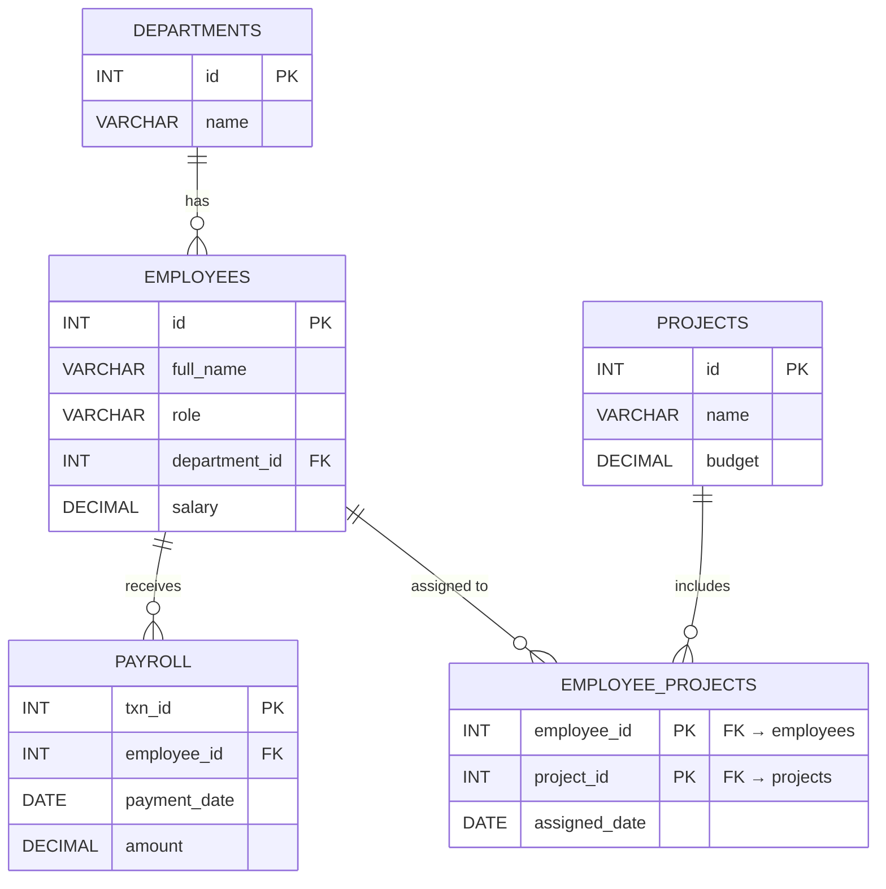

# MyHR Global — HR Management System

> A relational database project built using **MariaDB** and **SQL**, with a lightweight frontend dashboard for visualizing HR data.

---

This project implements a fully functional **Human Resource Management System (HRMS)** designed to manage employee records, departmental structure, project assignments, and payroll processing within an organization. It addresses the common challenge of maintaining consistent and queryable HR data across multiple interconnected entities. The system demonstrates core database design principles including normalization, referential integrity, and relational modeling through a real-world use case. A frontend dashboard complements the backend, providing a clear visual summary of all stored data — including live metrics such as total headcount, payroll totals, and project budgets.

---

## 📋 Table of Contents

- [Overview](#overview)
- [Technologies Used](#technologies-used)
- [ER Diagram](#er-diagram)
- [Table Descriptions](#table-descriptions)
- [Relationships](#relationships)
- [Design Decisions](#design-decisions)
- [Data Integrity](#data-integrity)
- [Sample Queries](#sample-queries)
- [Frontend Dashboard](#frontend-dashboard)
- [How to Run](#how-to-run)
- [Authors](#authors)

---

## 🧭 Overview

**MyHR Global** is a relational database-backed HR system that centralizes and manages four core domains of an organization:

- **Employees** — Personal and professional records for all staff
- **Departments** — Organizational units with headcount and payroll summaries
- **Projects** — Active initiatives with associated budgets
- **Payroll** — Monthly salary disbursement records per employee

The system currently tracks **10 employees** across **5 departments**, **3 active projects**, and a total payroll disbursement of **₹8.3 Lakhs**.

---

## 🛠️ Technologies Used

| Technology      | Purpose                             |
|-----------------|-------------------------------------|
| MariaDB         | Relational database engine          |
| SQL             | Schema definition and data querying |
| HTML / CSS / JS | Frontend dashboard interface        |
| Node.js         | Backend API and data serving layer  |

---

## 🗃️ ER Diagram

The schema models five tables with clearly defined primary keys, foreign keys, and cardinalities. The `employee_projects` junction table formally resolves the many-to-many relationship between employees and projects.



### Corresponding SQL Table Definitions

```sql
CREATE TABLE departments (
    id   INT PRIMARY KEY AUTO_INCREMENT,
    name VARCHAR(100) NOT NULL
);

CREATE TABLE employees (
    id            INT PRIMARY KEY AUTO_INCREMENT,
    full_name     VARCHAR(150) NOT NULL,
    role          VARCHAR(100) NOT NULL,
    department_id INT NOT NULL,
    salary        DECIMAL(10, 2) NOT NULL,
    FOREIGN KEY (department_id) REFERENCES departments(id)
);

CREATE TABLE projects (
    id     INT PRIMARY KEY AUTO_INCREMENT,
    name   VARCHAR(150) NOT NULL,
    budget DECIMAL(12, 2) NOT NULL
);

CREATE TABLE employee_projects (
    employee_id   INT NOT NULL,
    project_id    INT NOT NULL,
    assigned_date DATE,
    PRIMARY KEY (employee_id, project_id),
    FOREIGN KEY (employee_id) REFERENCES employees(id),
    FOREIGN KEY (project_id)  REFERENCES projects(id)
);

CREATE TABLE payroll (
    txn_id       INT PRIMARY KEY AUTO_INCREMENT,
    employee_id  INT NOT NULL,
    payment_date DATE NOT NULL,
    amount       DECIMAL(10, 2) NOT NULL,
    FOREIGN KEY (employee_id) REFERENCES employees(id)
);
```

---

## 📦 Table Descriptions

### 1. `departments`

| Column | Data Type    | Description                           |
|--------|--------------|---------------------------------------|
| `id`   | INT (PK)     | Unique identifier for each department |
| `name` | VARCHAR(100) | Name of the department                |

---

### 2. `employees`

| Column          | Data Type      | Description                          |
|-----------------|----------------|--------------------------------------|
| `id`            | INT (PK)       | Unique identifier for each employee  |
| `full_name`     | VARCHAR(150)   | Employee's complete full name        |
| `role`          | VARCHAR(100)   | Job title or designation             |
| `department_id` | INT (FK)       | References `departments(id)`         |
| `salary`        | DECIMAL(10, 2) | Monthly gross salary in rupees       |

---

### 3. `projects`

| Column   | Data Type      | Description                         |
|----------|----------------|-------------------------------------|
| `id`     | INT (PK)       | Unique identifier for each project  |
| `name`   | VARCHAR(150)   | Descriptive title of the project    |
| `budget` | DECIMAL(12, 2) | Total allocated project budget      |

---

### 4. `employee_projects` *(Junction Table)*

| Column          | Data Type   | Description                            |
|-----------------|-------------|----------------------------------------|
| `employee_id`   | INT (PK, FK) | References `employees(id)`            |
| `project_id`    | INT (PK, FK) | References `projects(id)`             |
| `assigned_date` | DATE         | Date employee was assigned to project |

---

### 5. `payroll`

| Column         | Data Type      | Description                            |
|----------------|----------------|----------------------------------------|
| `txn_id`       | INT (PK)       | Unique payroll transaction identifier  |
| `employee_id`  | INT (FK)       | References `employees(id)`             |
| `payment_date` | DATE           | Date on which salary was disbursed     |
| `amount`       | DECIMAL(10, 2) | Salary amount paid for that cycle      |

---

## 🔗 Relationships

| Relationship                  | Type         | Description                                                         |
|-------------------------------|--------------|---------------------------------------------------------------------|
| `departments` → `employees`   | One-to-Many  | A department has many employees; each employee belongs to one       |
| `employees` → `payroll`       | One-to-Many  | An employee may have multiple payroll records across pay cycles     |
| `employees` ↔ `projects`     | Many-to-Many | Resolved via the `employee_projects` junction table                 |

---

## 🧠 Design Decisions

**1. Separate `payroll` table instead of embedding salary history in `employees`**
The `employees` table stores the current salary, while `payroll` maintains an auditable transaction log. This separation supports historical tracking and avoids update anomalies.

**2. Departments pre-provisioned without employees**
Engineering and Marketing are created in advance with zero headcount. This allows the organizational structure to be defined independently of staffing — reflecting real-world HR planning practices.

**3. `employee_projects` junction table for many-to-many resolution**
An employee can work on multiple projects, and a project can involve multiple employees. A composite primary key `(employee_id, project_id)` uniquely identifies each assignment and enforces referential integrity on both sides.

**4. `txn_id` as surrogate key in `payroll`**
A dedicated transaction ID (rather than a composite key of employee + date) makes payroll records individually addressable and extensible for future audit trails or multi-cycle reporting.

---

## 🔒 Data Integrity

| Constraint Type     | Applied To                                        | Purpose                                                  |
|---------------------|---------------------------------------------------|----------------------------------------------------------|
| `PRIMARY KEY`       | All tables                                        | Ensures every record is uniquely identifiable            |
| `FOREIGN KEY`       | `employees.department_id → departments.id`        | Prevents assignment to a non-existent department         |
| `FOREIGN KEY`       | `payroll.employee_id → employees.id`              | Prevents payroll entries for non-existent employees      |
| `FOREIGN KEY`       | `employee_projects.employee_id → employees.id`    | Ensures junction integrity on the employee side          |
| `FOREIGN KEY`       | `employee_projects.project_id → projects.id`      | Ensures junction integrity on the project side           |
| `NOT NULL`          | Name, role, salary, amount, payment_date fields   | Ensures all critical fields are always populated         |
| `DECIMAL` precision | `salary`, `amount`, `budget`                      | Prevents floating-point errors in financial calculations |

> The total payroll displayed on the dashboard (₹8.3L) is derived by aggregating the `amount` column in the `payroll` table — consistent with individual salary values in the `employees` table.

---

## 💡 Sample Queries

---

### Query 1 — List all employees with their department names

**Relational Algebra:**

```
π(e.id, e.full_name, e.role, d.name, e.salary)
  ( ρ_e(employees) ⋈ (e.department_id = d.id) ρ_d(departments) )
```

**SQL:**
```sql
SELECT e.id, e.full_name, e.role, d.name AS department, e.salary
FROM employees e
JOIN departments d ON e.department_id = d.id
ORDER BY d.name, e.full_name;
```

---

### Query 2 — Department-wise headcount and total payroll

**Relational Algebra:**

```
γ(d.name ; COUNT(e.id) → headcount, SUM(e.salary) → total_payroll)
  ( ρ_d(departments) ⟕ (d.id = e.department_id) ρ_e(employees) )
```

*⟕ denotes Left Outer Join — preserves departments with zero headcount (e.g., Engineering, Marketing).*

**SQL:**
```sql
SELECT d.name                     AS department,
       COUNT(e.id)                AS headcount,
       COALESCE(SUM(e.salary), 0) AS total_payroll
FROM departments d
LEFT JOIN employees e ON e.department_id = d.id
GROUP BY d.id, d.name
ORDER BY total_payroll DESC;
```

---

### Query 3 — Total payroll disbursed per pay cycle

**Relational Algebra:**

```
γ(payment_date ; SUM(amount) → total_payroll_paid) ( payroll )
```

**SQL:**
```sql
SELECT payment_date,
       SUM(amount) AS total_payroll_paid
FROM payroll
GROUP BY payment_date;
```

---

### Query 4 — Highest-paid employee per department

**Relational Algebra:**

```
Let M = γ(department_id ; MAX(salary) → max_sal) ( employees )

π(d.name, e.full_name, e.salary)
  ( σ(e.salary = m.max_sal)
      ( ρ_e(employees)
          ⋈ (e.department_id = d.id) ρ_d(departments)
          ⋈ (e.department_id = m.department_id) ρ_m(M)
      )
  )
```

**SQL:**
```sql
SELECT d.name AS department, e.full_name, e.salary
FROM employees e
JOIN departments d ON e.department_id = d.id
WHERE e.salary = (
    SELECT MAX(salary)
    FROM employees
    WHERE department_id = e.department_id
)
ORDER BY e.salary DESC;
```

---

## 🖥️ Frontend Dashboard

The dashboard provides a real-time summary of the database state across four views:

| View        | Key Metrics Displayed                                  |
|-------------|--------------------------------------------------------|
| Employees   | 10 rows — name, role, department, salary               |
| Departments | 5 rows — headcount and total payroll per department    |
| Projects    | 3 rows — project name and allocated budget             |
| Payroll     | 10 rows — employee, payment date (31 Jan 2026), amount |

All four views share a global summary bar: **10 Employees · 5 Departments · 3 Projects · ₹8.3L Total Payroll Paid**.

Each view includes a real-time **filter/search** input and displays live row counts, ensuring usability alongside database correctness.

---

## ▶️ How to Run

This project runs entirely on your local machine — no external server or deployment is required. The frontend is served via a Node.js backend and the database runs on a locally installed MariaDB instance.

**Step 1 — Start the Backend Server**

Open the **Terminal** inside IntelliJ IDEA and run:

```bash
cd HRmgmt/Backend/
```

Press **Enter**, then run:

```bash
node app.js
```

The server will start and go live on your local machine.

**Step 2 — Open the Frontend**

Open any web browser and navigate to:

```
http://localhost:8080/index.html
```

This is the main dashboard of the HR Management System.

---

## 📁 Project Structure

```
HRmgmt/
├── Backend/
│   └── app.js              # Node.js backend server
├── Frontend/
│   ├── index.html          # Dashboard entry point
│   ├── style.css           # Stylesheet
│   └── app.js              # Frontend logic
├── schema.sql              # Table definitions and constraints
├── seed.sql                # Sample data for all tables
└── README.md
```

---

## 👥 Authors

Submitted as part of a **Database Management Systems (DBMS)** course project.
Built with MariaDB · SQL · Node.js · HTML / CSS / JS

| Name               | Enrollment No. |
|--------------------|----------------|
| Devraj Sangharajka | AU2420181      |
| Dvij Desai         | AU2420139      |

---
